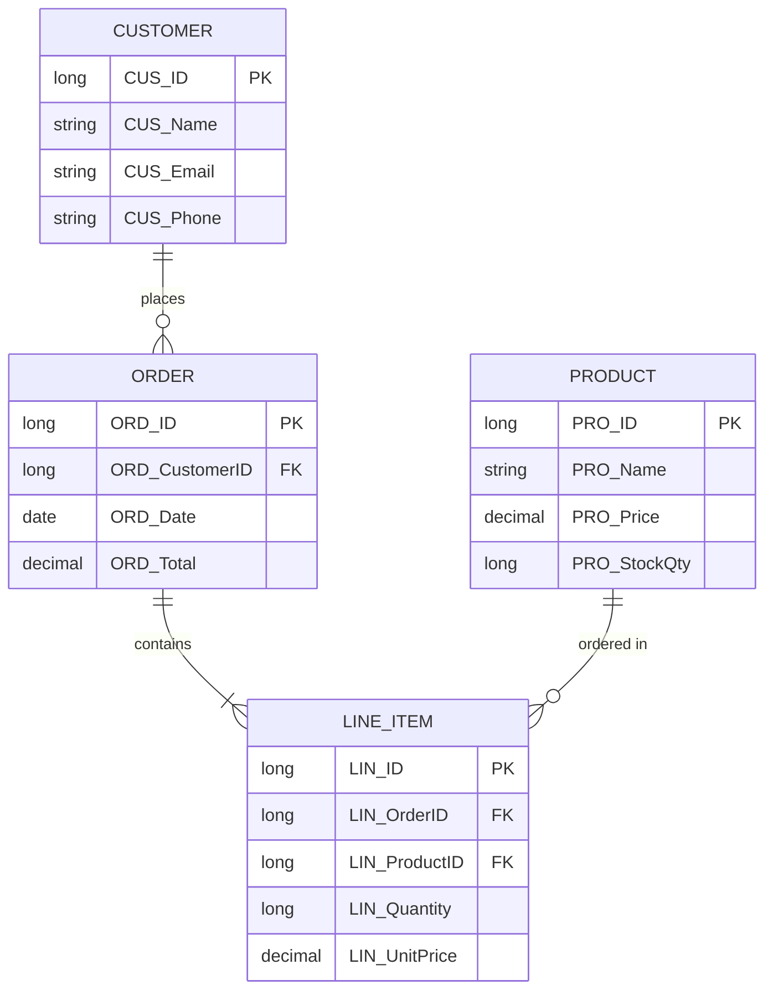
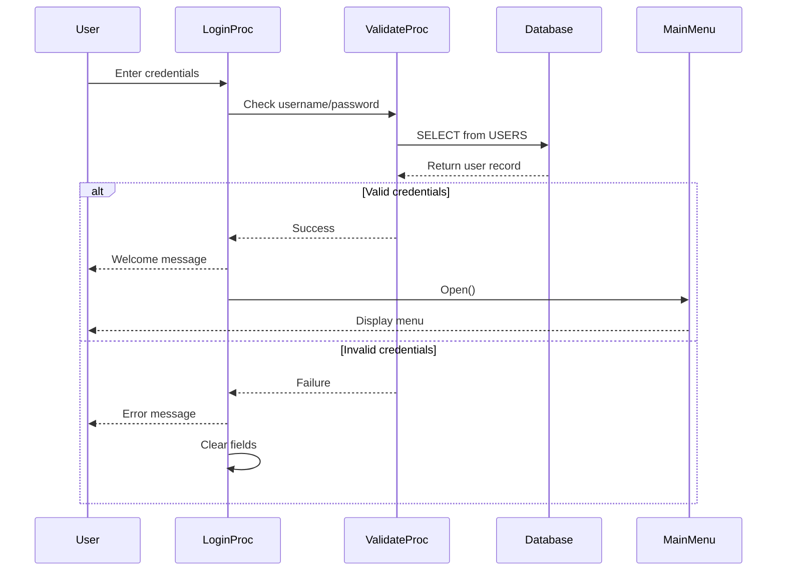
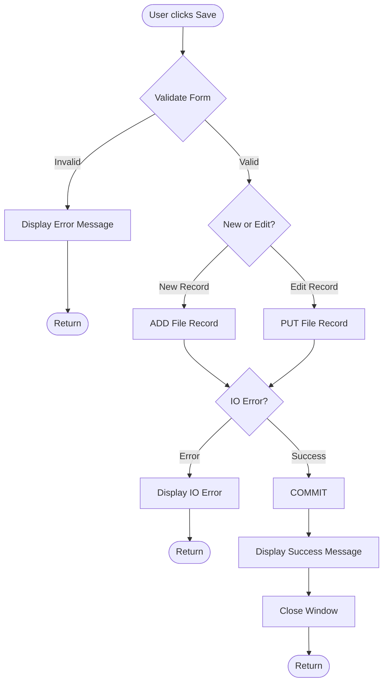
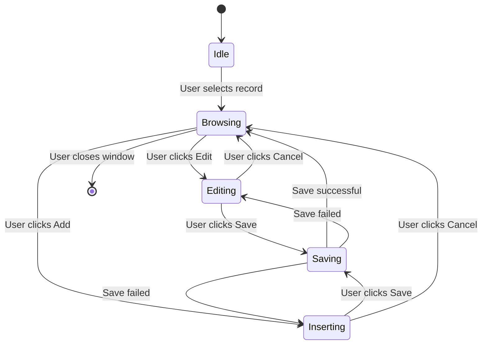
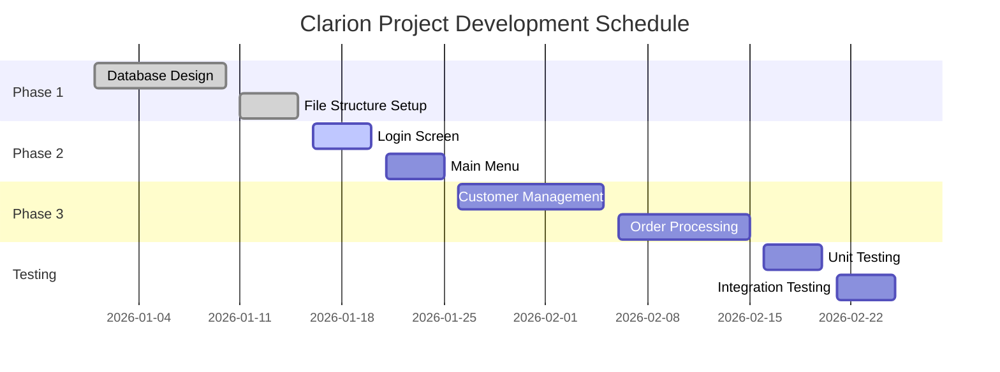
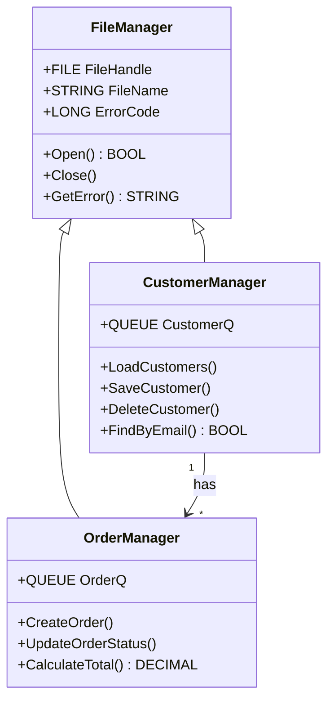

# Mermaid Diagram Examples

Mermaid lets you create diagrams using simple text syntax! Here are some examples relevant to Clarion development:

## 1. Database Entity Relationship Diagram

Perfect for documenting your Clarion FILE structures:



## 2. Program Flow / Sequence Diagram

Document how your Clarion procedures interact:



## 3. Flowchart - Decision Logic

Document complex IF/CASE structures:



## 4. State Diagram - Screen/Window States

Document window behavior:



## 5. Gantt Chart - Project Timeline

Plan your development sprints:



## 6. Class Diagram - OOP Structure

For ABC/Clarion OOP designs:



## 7. Git Flow - Branching Strategy

Document your repository workflow:

```mermaid
gitgraph
    commit id: "Initial commit"
    commit id: "Add login module"
    branch develop
    checkout develop
    commit id: "Start customer module"
    branch feature/customer-crud
    checkout feature/customer-crud
    commit id: "Add customer form"
    commit id: "Add validation"
    checkout develop
    merge feature/customer-crud
    checkout main
    merge develop tag: "v1.0"
    checkout develop
    commit id: "Bug fixes"
```

## Tips for Using Mermaid in Clarion Projects

- **Document as you code**: Add mermaid diagrams to README files in each module
- **ERD diagrams**: Perfect for the .DCT dictionary documentation
- **Flowcharts**: Great for documenting complex LOOP/IF structures before coding
- **Sequence diagrams**: Show multi-procedure interactions (especially with global extensions)
- **Version control**: Since it's text, diagrams are diffable in git!

---

*Edit this file in the Markdown Editor and see the diagrams render in real-time!* 🎉
