# Mermaid Diagram Examples

This markdown editor now supports **Mermaid diagrams**! Just use` ```mermaid ` code blocks.

## Example 1: Colorful Flowchart

```mermaid
graph TD
    A[Start]:::startClass --> B{Is it working?}
    B -->|Yes| C[🎉 Success!]:::successClass
    B -->|No| D[Debug it]:::debugClass
    D --> A
    
    classDef startClass fill:#4a90e2,stroke:#2e5c8a,color:#fff
    classDef successClass fill:#82ca9d,stroke:#5a9d6f,color:#fff
    classDef debugClass fill:#ffc658,stroke:#d9a13a,color:#000
```



## Example 2: Sequence Diagram


## Example 3: Entity Relationship Diagram


## Example 4: Gantt Chart


## Example 5: State Diagram


## Regular Code Blocks Still Work!

```clarion
MyProcedure PROCEDURE()
Message CODE
  MESSAGE('Hello from Clarion!')
  RETURN
```

```javascript
function hello() {
    console.log('JavaScript works too!');
}
```

Pretty cool, right? 🚀
